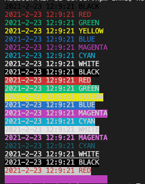

## logmanager

A simple NPM manager of log.



## Documentation 

### Instalation

```
npm i @kolowy/logmanager
```

### Usage

```javascript
const { logManager }  = require('@kolowy/logmanager');
logManager("message", "color")
logManager("BLACK", 'Black')
```

list of color : Black, Red, Green, Yellow, Blue, Magenta, Cyan, White
Example : 
```javascript
const { logManager }  = require('@kolowy/logmanager');
    logManager("BLACK", 'Black')
    logManager("RED", 'Red')
    logManager("GREEN", 'Green')
    logManager("YELLOW", 'Yellow')
    logManager("BLUE", 'Blue')
    logManager("MAGENTA", 'Magenta')
    logManager("CYAN", 'Cyan')
    logManager("WHITE", 'White')
```

### Background

To have a Backgroud color : add `-` in front of the color

Example :
```javascript
const { logManager }  = require('@kolowy/logmanager');
    logManager("BLACK", '-Black')
    logManager("RED", '-Red')
    logManager("GREEN", '-Green')
    logManager("YELLOW", '-Yellow')
    logManager("BLUE", '-Blue')
    logManager("MAGENTA", '-Magenta')
    logManager("CYAN", '-Cyan')
    logManager("WHITE", '-White')
```


### Other color

Example :
```javascript
const { logManager }  = require('@kolowy/logmanager');
    logManager("Bright", 'Bri')
    logManager("Dim", 'DimCyan')
    logManager("Underscore", 'UnderWhite')
    logManager("Blink", 'Blink')
    logManager("Reverse", 'Rev')
    logManager("Hidden", 'Hid')
```

### combinaisons

```javascript
const { logManager }  = require('@kolowy/logmanager');
    logManager("MAGENTA", 'BriMagenta')
    logManager("CYAN", 'DimCyan')
    logManager("WHITE", 'UnderWhite')
    logManager("BLACK", 'Blink-Black')
    logManager("RED", 'Rev-Red')
    logManager("MAGENTA", 'Hid-Magenta')
```
